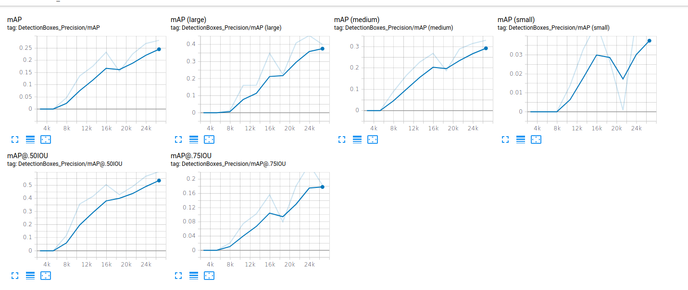
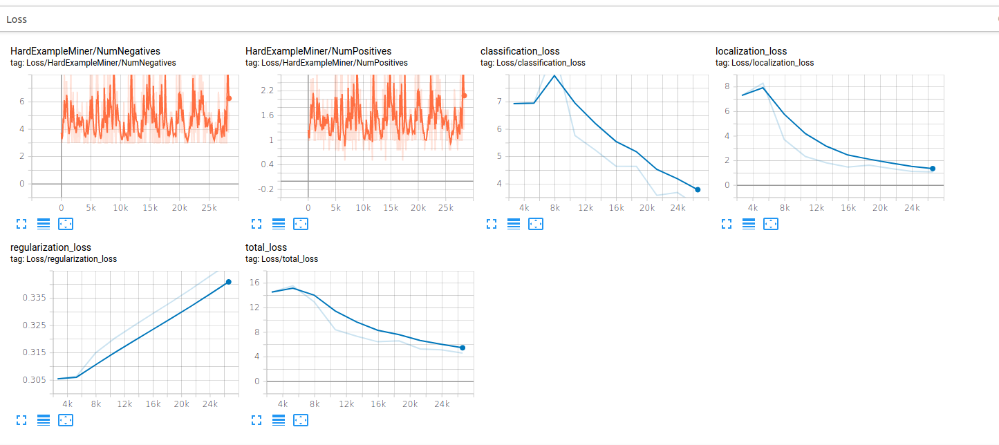
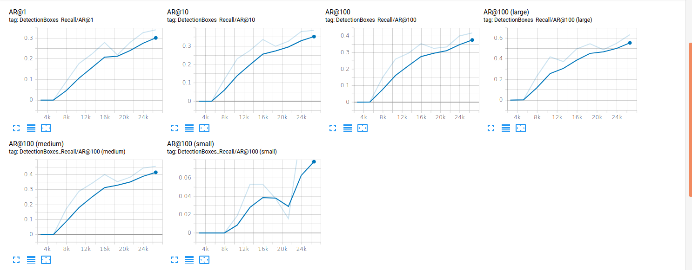

# Football Detection
Trained a SSD mobilenet model for detecting footballs using coco pretrained weights and Tensorflow Object Detection API

The training was done using Google colab to leverage GPU for compute  

## Dataset
The Dataset used is private property and hasn't been uploaded (`1000 images`,`1000 annotations in xml format`)

## How it works
* [partition_dataset.py](https://github.com/nerdykamil/football_detection/partition_dataset.py) - Used to partition the dataset into test and train 
* [label_map.pbtxt](https://github.com/nerdykamil/football_detection/tf_records/label_map.pbtxt) - Contains labels for classes present in training 
* [generate_tfrecord.py](https://github.com/nerdykamil/football_detection/generate_tfrecord.py) - For generating tf records for train and test images
* [ssd_mobilenet_v2_quantized_300x300_coco_football.config](https://github.com/nerdykamil/football_detection/ssd_mobilenet_v2_quantized_300x300_coco_football.config) - Place this file in models/research/object_detection/samples/configs/
* [training.ipynb](https://github.com/nerdykamil/football_detection/training.ipynb) - Run this notebook using google colab and follow along the instructions to train the model and produce it's tflite file to be deployed in phones.

## Results

1. mAP

2. Loss

3. Recall

     

